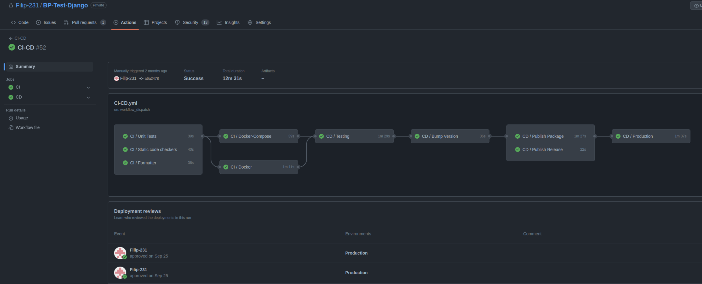
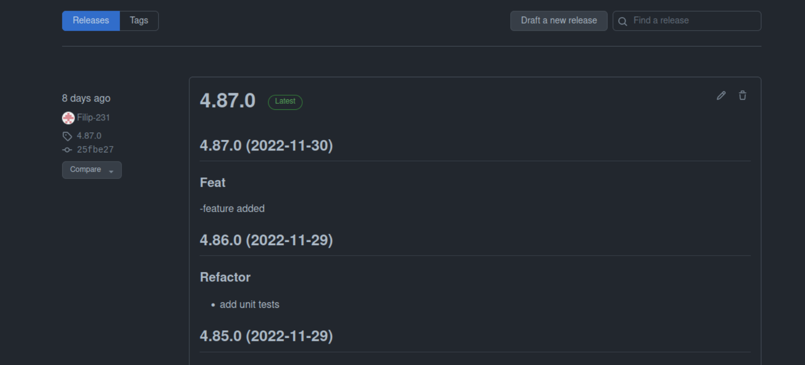
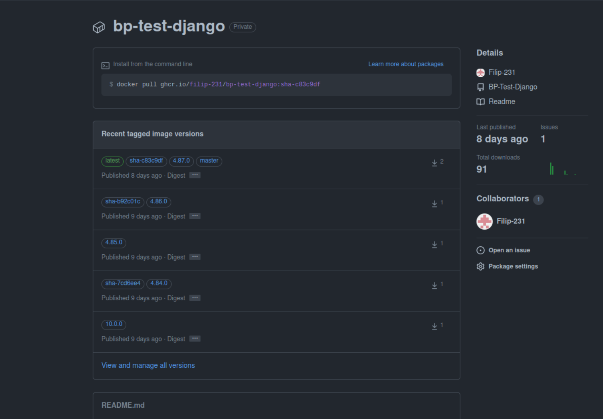
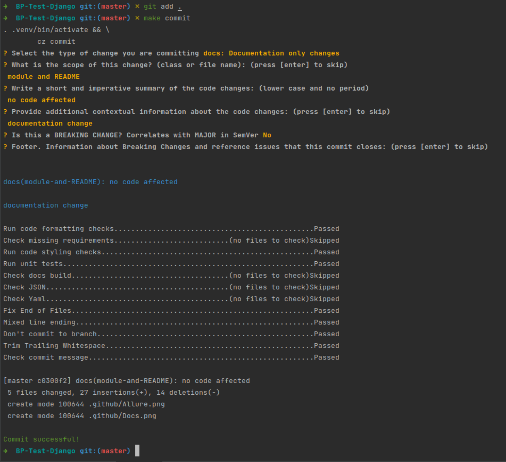
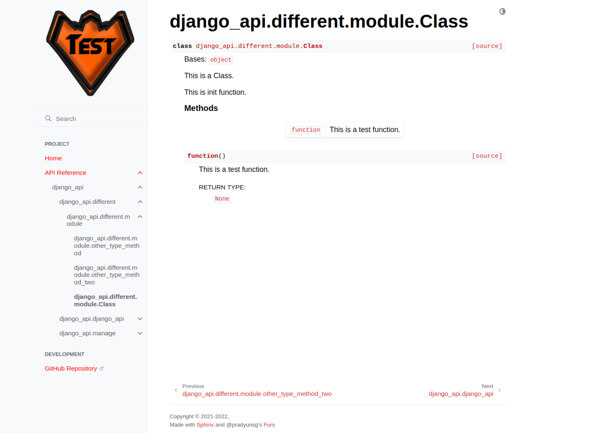
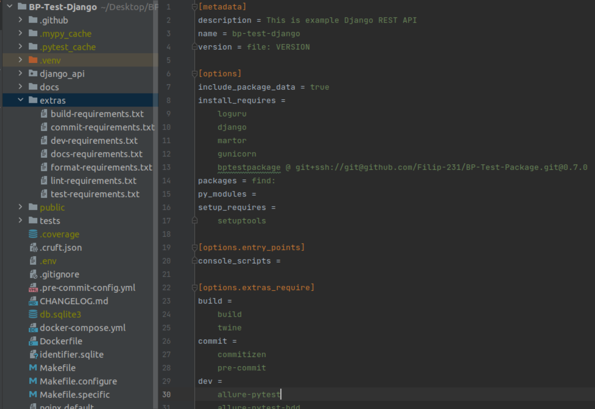

# BP-Microservices
The main conception is to systematize creation process of new repositories.  
There are many common actions to do when creating a new project, why don't automize them?

This repository is build from:
* [**BP-Templates**](https://github.com/Filip-231/BP-Templates): repository with project templates and sub-repository **BP-Init** with initial makefiles.
From that repository new projects can be build. Thanks to **cookiecutter** package if this repository 
will change, you can update all child repositories by command `make update-project`. To update initial 
makefiles from [**BP-Init**](https://github.com/Filip-231/BP-Init) sub-repository run `make update-makefiles`. If you want to do both of these things run 
`make update`.
* [**BP-Test-Dbt**](https://github.com/Filip-231/BP-Test-Dbt):  example of DBT project created to manage **SQL** code.
* [**BP-Test-Django**](https://github.com/Filip-231/BP-Test-Django): production **REST API** with database and admin page, which is deployed on multiple environments.
* [**BP-Test-Package**](https://github.com/Filip-231/BP-Test-Package): lightweight **CLI** tool which can be shared between multiply apps.


## Prerequisites
Ensure you have the following prerequisites:
* Install python 3.9 on your local machine
* Install Allure 2.9.0
* Install docker
* Install docker-compose
* Install make: `sudo apt install make`

## Process of creation new repositories
The journey of creation a new project start with cloning **BP-Init** repository.  
Clone **BP-Init** repository and name it as your new project:
```
git clone git@github.com:Filip-231/BP-Init.git BP-Test-Django 
```

Enter a directory what you just created:
```
cd BP-Django-Test
```
This repository is made to initialize new projects with a few important commands included:

Fill **_PROJECT** with a name of you new project, and **_USER** with the name of your Github user to reset git, specify new project and git user.
```
make git _PROJECT=BP-Test-Django _USER=Filip-231 
```
Now the **BP-Init** repository is transformed into your own new repository named: **BP-Test-Django**.

Then you can choose between several templates like django / package / dbt depending on what repository you want to create.

Let's create Django REST API. [The example repository created by those steps.](https://github.com/Filip-231/BP-Test-Django)
```
make init LANGUAGE=django
```
For technical purposes there is a need to add project name and username to **.env** file:
```
make set-project-name _PROJECT=BP-Test-Django _USER=Filip-231
```

Commit everything to a new repository (**BP-Test-Django**) what you have just created:
```
make all
```
Now you can install your local environment:
```
make install
```

***
Every of above steps can be run by the following command with replaced **_PROJECT** and **_USER**:

```
git clone git@github.com:Filip-231/BP-Init.git abc-test && \
cd abc-test && make git _PROJECT=abc-test _USER=Filip-231 &&\ 
make init LANGUAGE=django && make set-project-name _PROJECT=abc-test _USER=Filip-231 \
&& make all && make install
```

***
# Features
There are many benefits of creation new app from that repository. Every template have a different one.  
Here are the features of **django** template:

After installing local environment `. .venv/bin/activate` and `make help` to see help message.
```
all                 commit and push all changes
brew-allure         install allure with brew long
build               build docker-compose image
bump                (PART= ) bump the release version - deduced automatically from commit messages unless PART is provided
changelog           (UNRELEASED= current version) update the changelog incrementally.
check-commit        check the commit message is valid
clean               clean up temp and trash files
commit              make interactive conventional commit
docker-build-dev    build docker image locally
docker-download-package (VERSION= specifies version) download package from GH package registry
docker-exec         exec in a docker container
docker-run-dev      run docker image including .env file
docker-run-package  (VERSION= ) runs package downloaded from GH package registry
docs                render documentation
down                down the compose
down-volumes        remove docker images and volumes
format              format code
freeze              (UPGRADE= ) generate requirements from setup.cfg
get-version         output the current version
git                 reset git, specify new project and git user
help                display this help message
init                (LANGUAGE=django/tool/dbt) create cruft project and install pre-requirements
install             install all requirements
lint                run static code checkers
pre-install         install pre-requirements
release             create a new github release
set-project-name    (_PROJECT=project _USER=user ) set initial environment
tag                 pull tags and tag a new version
test                (ALLURE=True BROWSE=True) run tests
up                  (ALLOWED_HOSTS= SECRET_KEY= ) up the compose
update-makefiles    update configuration files
update-project      update cruft project and install pre-requirements
update              update cruft project and configuration files
venv                install virtual environment

```

All these commands are used to effectively manage the django project.
***
## Continuous Integration and delivery
Complete CI-CD process will be visible in GitHub Actions [page](https://github.com/Filip-231/BP-Test-Django/actions) containing:
* **CI** - run on every push to master and on pull requests.
  * Test  - run unit and E2E tests.
  * Format - checks if code is formatted.
  * Lint - runs all static code checkers with prospector.
  * Docker - build and up docker image.
  * Docker-compose - build and up compose.
* **CD** - manual trigger, automatic deploy to Oracle cloud environment, GH releases and packages.
  * Deploy Testing - deploy to testing environment - linux instance with **TESTING_HOST_IP**.
  * Bump Version - bump current version and push a tag to a repository - after review and approve.
  * Publish Release - publish new release to GitHub [releases](https://github.com/Filip-231/BP-Test-Django/releases).
  * Publish Package - build docker package and push to GitHub [packages](https://github.com/Filip-231?tab=packages&repo_name=BP-Test-Django).
  * Deploy Production - deploy to production - linux instance with IP **PROD_HOST_IP** - after review and approve.
* **CI/CD** - manual trigger, includes CI and CD pipelines connected.

### CI/CD Pipeline



### Releases
During CD pipeline the new GH release will be created with zipped code, changelog will be updated with new commits pushed master branch, 
tag with a new version will be created.



### Packages
The new package with tagged version will be created. 
It can be pulled directly from GH packages with `make docker-download-package` and run `make docker-run-package`.



### Unified interactive commits with pre-hook
Pre-hook checks depends on what scope has been changed.

<center>



</center>

### Docs
After invoking `make docs` the **sphinx** documentation will be created in public folder. You can open it with a browser.



### Allure
You can invoke `make test ALLURE=True BROWSE=True` to make and open allure report with coverage.


### Environment Setup
There is **setup.cfg** file which creates list of requirements for: build, dev, lint, test, docs, format, commit.  
To create specified environemt you can run `make install EXTRAS=lint`.
These environments are separated to speed up the CI/CD process, and to include only necessary packages in a final product.
There is a possibility to add a private repository as a custom package (bptestpackage) and install directly in environment. 

To render requirements from setup.cfg run `make freeze` to install dependencies `make install`, to update `make freeze UPGRADE=True`.

<center>
<div style="width: 60%; height: 40%">



</div>
</center>

## Additional notes
To add a new module: `git submodule add git@github.com:Filip-231/BP-Test-Dbt.git BP-Test-Dbt`